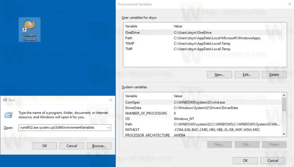
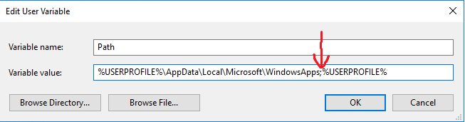

# Basic configuration

## All OS


Check this out!


## Specific <mark style="color:green;">Windows</mark> stuff

* Place the terraform .exe file in a system folder like C:\ preferably \~\ (aka %USERPROFILE% aka <mark style="color:green;">**user folder**</mark>)
* Then you have to <mark style="color:green;">**setup the environment variables**</mark>, because you want to use terraform in any folder without typing the directory where it is located.
* If you don't know how to do these steps, continue reading.

### Setting up the environment variables

Open Run dialog (Win + R), paste and execute:

`rundll32.exe sysdm.cpl,EditEnvironmentVariables`



Select <mark style="color:green;">**Path**</mark> user variable, click on Edit, and add the path were terraform.exe is located (Win10).

<mark style="background-color:orange;">**NOTE:**</mark> If you placed terraform in your user folder, feel free to add only <mark style="background-color:green;">**%USERPROFILE%**</mark>** ** at the end of the string in PATH user variable.

After doing the previous steps, using the CLI (cmd or any other CLI) check if windows can use terraform properly thought the CLI using `terraform version` and you should get something like this output (<mark style="color:red;">**if you got an error keep reading**</mark>):

```
C:\Users\SomeUser>terraform version
Terraform v1.1.9
on windows_amd64

Your version of Terraform is out of date! The latest version
is 1.2.1. You can update by downloading from https://www.terraform.io/downloads.html
```

You should get this output or similar if everything is working properly (mine is outdated).


<mark style="color:red;">**If you have some kind of error**</mark>, it's highly probable that you <mark style="color:red;">**didn't set**</mark> the **environment variable path** properly.

Some windows version you have to use ";" to separate the different values of path variable, you cannot leave a space between ";" and the next path variable you created, it has to be like this.



